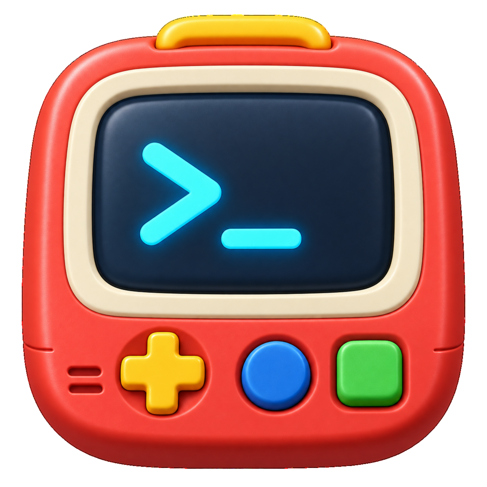

# toyoterm

<p align="center">
  
</p>

[English](README.md)

toyotermは、Rustと組み込みmrubyで作る実験的なプログラマブル・ターミナルエミュレータです。ターミナルのホットパスはネイティブ実装のまま保ち、設定、動的キーバインド、ランタイムイベント、コマンドにRubyを利用します。

これは私が個人的に使うためのプロジェクトであり、実験的に作っているおもちゃです。

> [!IMPORTANT]
> toyotermは活発に開発中です。GUIの各Workspace、タブ、分割Paneは独立したPTYとターミナルセッションを持ちます。複数OSウィンドウ対応は初期リリース後へ明示的に延期しています。

## 機能

- ネイティブPTYとプラットフォーム標準シェル
- `wgpu`と`glyphon`によるGPU描画ウィンドウ
- `alacritty_terminal`を利用したVTシーケンス解析
- UTF-8入力、リサイズ、スクロールバック、マウスホイール
- IME preedit描画とcommit・cancel処理
- テキスト選択とクリップボードのコピー・ペースト
- mruby 4.0を組み込んだ設定ランタイム
- ネイティブコマンドを発行できる動的Rubyキーバインド
- アトミックな設定リロード。不正な更新時は以前の設定を維持
- 起動・設定reload、Window・Tab・Pane、title・cwd・bell、Workspace変更のRubyイベント
- タブ、ペイン分割、ワークスペースに対応したネイティブCommand・Muxモデル
- PaneごとにPTYとTerminalBackendを持つGUIタブ
- Paneごとのresizeとfocusに対応した分割Pane描画
- マウス操作とキーボード操作に対応したタブバー
- Workspaceごとのfocus復元に対応したWorkspaceバー
- fuzzy検索対応のCommand Paletteとユーザー定義Rubyコマンド
- 起動中GUIの単一mruby VMへ接続するライブRuby REPL
- metadata・互換性検査・failure isolationを備えたlocal Ruby plugin
- viewportとscrollbackを対象にしたliteral検索
- OSC 8 hyperlinkと通常URLの検出、安全なmodifier+click
- shell integration、local IPC CLI、Ruby status bar

## 現在の状態

主な開発環境はLinuxです。アーキテクチャと依存ライブラリはクロスプラットフォームを意識していますが、macOSとWindowsではまだ十分な動作検証を行っていません。

初回リリースの対象外：

- 複数OSウィンドウ
- 画像プロトコル、セッション永続化

主要機能は実装済みですが、初回リリース前にLinux Wayland/X11、macOS、Windowsでの対話的な実機検証と性能・画像回帰テストが必要です。

## ビルドと起動

### 必要なもの

- 新しい安定版Rustツールチェーン
- 同梱mrubyをビルドするためのCコンパイラ
- `winit`・`wgpu`が要求する各プラットフォームの開発ライブラリ

LinuxではWaylandまたはX11のデスクトップセッションが必要です。不足している場合は、利用中のディストリビューションからCビルドツール、`pkg-config`、Wayland/X11、xkbcommonの開発パッケージをインストールしてください。

リポジトリをcloneした後、次のコマンドで起動します。

```sh
cd toyoterm
cargo run
```

最適化したバイナリをビルドして起動する場合：

```sh
cargo build --release --locked
./target/release/toyoterm
```

### インストール・更新・アンインストール

ReleaseからOS・CPUに合う成果物を取得します。Linuxではarchiveを展開して
`./install.sh`を実行すると、`~/.local`への導入とdesktop menu登録を行います。
macOSではDMGを開いて`toyoterm.app`をApplicationsへdragします（`.tar.gz`も
提供します）。Windowsではportable zipを展開し、`Install-Toyoterm.ps1`を実行
するか、installせず展開先からそのまま利用できます。

新しい成果物を同じ場所へinstallすると更新できます。Linuxのuninstallerは
`~/.local/lib/toyoterm/uninstall.sh`、Windowsでは実行ファイルと同じdirectoryの
`Uninstall-Toyoterm.ps1`です。ユーザー設定`~/.config/toyoterm/`は保持します。
各ReleaseにはSHA-256 checksumを同梱します。任意のinstall先、portable利用、
検証、削除方法は[packaging・install guide](docs/packaging.md)を参照してください。

設定ファイルを明示する場合：

```sh
cargo run -- --config /path/to/config.rb
```

起動中のGUIへライブRuby REPLで接続するには、別の端末で次を実行します。複数行入力、`:history`、`exit`に対応します。

```sh
cargo run -- ruby console
```

Command Paletteは`Ctrl+Shift+P`（macOSでは`Cmd+Shift+P`）で開きます。

## 設定

設定ファイルは次の優先順位で読み込まれます。

1. `--config`で指定したパス
2. `TOYOTERM_CONFIG_FILE`
3. `~/.config/toyoterm/config.rb`

デフォルトパスのファイルは省略可能です。明示的に指定したファイルは存在し、正しいRubyである必要があります。

設定例：

```ruby
Toyoterm.configure do |config|
  config.font do |font|
    font.family = "monospace"
    font.fallback = ["Noto Sans Mono CJK JP", "Noto Color Emoji"]
    font.size = 14
    font.weight = 400
  end

  config.colors do |colors|
    colors.background = "#090b0e"
    colors.foreground = "#dce1e8"
    colors.cursor = "#f5f7fa"
    colors.selection = "#375891"
    # ANSIインデックス0〜15はテーマに合わせて個別に変更できます。
    colors.ansi[1] = "#ff5f56"
  end

  config.window.opacity = 0.96
  config.scrollback_lines = 20_000
  config.leader key: "b", mods: "CTRL", timeout: 1000

  # 必要な場合はシェルを明示できます。省略時はプラットフォーム標準です。
  # config.default_shell = "/bin/zsh"

  config.bind "CTRL+SHIFT+H" do |context|
    context.pane.send_text("echo hello from mruby\n")
  end

  # 一般的な操作はNative Actionへcompileされ、キー入力時にmrubyを呼びません。
  config.keys do
    leader("v").split(:right)
    ctrl_shift("e").split(:right)
    ctrl_shift("o").activate_pane(:right)
    ctrl_shift("t").new_tab
    ctrl_shift("r").reload_config
  end
end

Toyoterm.on :app_started do |event|
  event.pane.send_text("echo toyoterm started\n")
end

Toyoterm.on :config_reloaded do |event|
  event.pane.send_text("echo config reloaded\n")
end
```

ToyotermはANSI 256色の前景色と背景色を描画します。`colors.ansi`ではテーマの
基本色であるインデックス0〜15を変更できます。インデックス16〜231は標準の
xterm 6×6×6カラ―キューブ、232〜255はグレースケールです。`colors.ansi`配列
全体を代入する場合は、`#RRGGBB`形式の文字列をちょうど16個指定してください。

`font.fallback`は省略できます。CJK、emoji、記号などの不足グリフに対し、インストール済みのフォントを指定順で試した後、OS標準のfallbackを使います。存在しないフォント名はフォントシステムが読み飛ばします。

### キーバインド

キー名は大文字・小文字を区別しません。修飾キーには`CTRL`、`SHIFT`、`ALT`、`SUPER`などを使用します。名前付きキーは`ENTER`、`TAB`、`SPACE`、矢印キー、ナビゲーションキー、`F1`から`F12`に対応しています。

`config.keys`では`ctrl`、`ctrl_shift`、`primary`、`primary_shift`、`alt`、`super_key`、`leader`、`physical`ヘルパーを使用できます。`primary`はmacOSで`SUPER`、Linux・Windowsで`CTRL`に展開されるため、1つの設定でOSごとの慣習に合わせられます。modifier名はOS間で共通で、macOSのOptionは`ALT`、macOSのCommandとWindowsキーは`SUPER`です。`physical("KeyH", "CTRL")`のように指定すると、論理文字ではなく物理キー位置へ割り当てられます。両方が一致した場合はphysical設定、組み込みGUIショートカットと競合した場合はユーザー設定を優先します。同じchordの重複定義は設定エラーです。

`config.leader`では、ミリ秒単位のtimeout付きLeader prefixをネイティブ側へ設定できます。`leader("v")`の割り当てはmrubyを呼ばずに解決されます。Leader prefix自体は破棄し、不一致またはtimeout後の次キーは通常のキー処理へ戻します。Prefixのrepeatは元のtimeoutを延長せずに破棄し、IME入力、フォーカス喪失、設定reloadではLeader待機状態を解除します。

割り当てのないキーはmrubyを呼ばず、ネイティブのターミナルキーエンコーダへ直接渡されます。Ruby callbackで例外が発生した場合はエラーをログへ出し、シェルの実行を継続します。

Ruby callbackからは`Toyoterm.clipboard.read`と`Toyoterm.clipboard.write(text)`でホストのテキストクリップボードを操作できます。動的キーバインドまたはイベントcallbackの実行直前に、クリップボードのsnapshotを更新します。プラットフォームのクリップボードを利用できない場合、`read`は`RuntimeError`を発生させます。書込みはcallbackが正常終了した後だけ反映するため、例外時は他のqueue済みcommandと一緒にロールバックされます。

```ruby
config.bind "CTRL+SHIFT+Y" do
  Toyoterm.clipboard.write("pane #{Toyoterm.current_pane.id}")
end

config.bind "CTRL+SHIFT+P" do |context|
  context.pane.send_text(Toyoterm.clipboard.read)
end
```

trusted configからは、ホストの環境変数、filesystem、子processも利用できます。

```ruby
home = Toyoterm.env["HOME"]
contents = Toyoterm.read_file("/path/to/file")
result = Toyoterm.spawn("git", "status", "--short")
warn result.stderr unless result.success?
```

`Toyoterm.env`はRuby VM作成時の環境変数snapshotのコピーを返し、Hashを変更してもprocess環境は変わりません。UTF-8で表せないentryは含まれません。path、program名、引数はUTF-8かつNUL byteを含まない文字列に限ります。`read_file`は内容のbyteを保持したRuby Stringを返します。`spawn`はScript Thread上で同期実行し、byteを保持した`stdout`と`stderr`をcaptureします。戻り値の`Toyoterm::ProcessResult`は`stdout`、`stderr`、`exit_status`、`success?`を持ち、portableな終了codeがない場合は`-1`です。filesystem操作とprocess起動の失敗は`RuntimeError`になり、子processの非zero終了は通常の結果として返ります。PTY読取りと描画は止まりませんが、長時間動く子processは後続のRuby callbackを待たせます。

configはtrusted codeであり、MVPではこれらのAPIに制限を設けません。local pluginも現在は同じmruby VMで動作し、filesystem、process、environment、clipboardにconfigと同じ権限を持ちます。そのためpluginの導入は任意code実行の許可に相当します。sourceと更新元を信頼できるpluginだけを導入してください。filesystem・process・network・clipboardを分離するcapability modelは、存在しないsandboxを保証せず後続設計へ延期します。

### Local plugin

起動時とconfig reload時に、`~/.config/toyoterm/plugins/`直下の`*.rb`をファイル名の辞書順で読み込みます。その後、configで指定したpluginを記述順に追加します。相対pathは宣言元のconfigまたはpluginファイルを基準に解決し、`~/`はhome directoryへ展開します。

```ruby
Toyoterm.plugin "plugins/project.rb"
Toyoterm.plugin "~/.config/toyoterm/extra/status.rb"
```

各pluginファイルは、一意なnameとsemantic versionを持つpluginをちょうど1つ定義する必要があります。任意の`requires`では、toyoterm plugin API version（`0.1.0`）への条件を、`,`区切りの`=`、`<`、`<=`、`>`、`>=`で指定できます。

```ruby
Toyoterm::Plugin.define "git-tools" do |plugin|
  plugin.version = "0.1.0"
  plugin.requires = ">= 0.1.0, < 0.2.0"

  plugin.command :git_root do |context|
    context.pane.send_text("git rev-parse --show-toplevel\n")
  end

  plugin.on :bell do |event|
    event.pane.badge = "bell"
  end

  plugin.bind "CTRL+G" do |context|
    context.pane.send_text("git status\n")
  end

  plugin.keys do
    ctrl_shift("G").command(:git_root)
  end
end
```

`plugin.command`、`plugin.on`、`plugin.bind`、`plugin.keys`は、main configと同じcommand、event、dynamic binding、native binding APIを使用します。同じcanonical pathの重複読込は無視します。plugin nameや登録の重複、不正なmetadata、API version非互換、読込不能なファイル、Ruby例外が発生した場合は、そのpluginによる登録をすべてrollbackして無効化し、残りのpluginの読込を続け、`toyoterm::script`へwarningを記録します。config自体のエラーは、従来どおり候補VM全体をatomicに拒否します。

### Rubyオブジェクトモデル

各callbackでは、`Toyoterm.current_workspace`、`current_window`、`current_tab`、`current_pane`から最新のsnapshotを参照できます。`Toyoterm.workspaces`、`windows`、`workspace(name)`で検索でき、Workspace・Window・Tabから子要素を取得できます。Paneのメタデータは`title`、`cwd`、`pid`、`command_running?`、`last_exit_status`です。command関連フィールドは[Shell integration](docs/shell-integration.md)を有効にすると更新されます。`split`、`close`、`focus`／`activate`、`new_tab`、`create_window`などの変更操作はNative Commandをqueueし、callbackが正常終了した後に反映します。保存したオブジェクトのnative実体が削除済みの場合は`Toyoterm::InvalidHandleError`を発生させます。

`pane.badge`はPane IDに紐づくcallback用表示メタデータとして、現在のRuby VMが生存する間保持します。badgeの描画はこのAPI契約から分離しています。`pane.chdir`は提供しません。作業ディレクトリはshellが所有するため、設定から変更する場合は対象shell向けに適切にescapeした`pane.send_text("cd ...\n")`を使用します。

### Runtime event

`Toyoterm.on`では、起動・reloadイベントに加えて、`window_created`、`window_closed`、`tab_created`、`tab_closed`、`pane_created`、`pane_closed`、`pane_focused`、`title_changed`、`cwd_changed`、`bell`、`workspace_changed`を購読できます。`Toyoterm::Event`は`name`、`workspace`、`window`、`tab`、`pane`、`title`、`cwd`を公開し、イベントと無関係な属性は`nil`です。削除イベントには削除済みオブジェクトの型付きIDが残りますが、その状態を参照すると`Toyoterm::InvalidHandleError`が発生します。`cwd_changed`はshellが出力するOSC 7の`file://`通知から生成します。

native側の発生元はmrubyを直接呼ばず、すべてのイベントを単一のFIFO queueへ追加します。各callbackを最後まで実行し、queueされたcommandを反映してから次のイベントを配送します。そのcommandから発生したイベントはqueue末尾へ追加するため、callbackへ再入しません。自己生成イベントの無限loopを防ぐため、1 application turnあたり1,024件を上限とします。handler未登録のイベントはRuby VMを呼ぶ前に破棄します。

optionalなstatus barは`Toyoterm.status(interval: 1.0)`で設定できます。callbackのcontextから現在の`workspace`、`window`、`tab`、`pane`を参照でき、戻り値を文字列として表示します。callback未設定時はbarを表示しません。100ms未満のintervalは拒否し、callbackはscript workerで実行するため、遅いstatus生成がterminal描画をblockしません。status callbackがqueueしたcommandは破棄します。

```ruby
Toyoterm.status(interval: 1.0) do |context|
  [context.workspace.name, context.pane.cwd].compact.join(" | ")
end
```

### ホットリロード

`Toyoterm.reload_config`は、起動時に選択されたものと同じファイルを再読込します。新しいソースは別のmruby VMで評価・検証され、成功した場合だけ有効な設定と入れ替わります。正常に再読込できると、実行中のターミナルセッションを維持したまま、配色、フォントメトリクス、透明度、スクロールバック、キーバインド、イベントハンドラを更新します。

設定エラーにはソースのファイル名、行番号、Ruby backtraceを表示します。再読込に失敗した場合は、それまでの設定を維持します。

GUIで設定の読込に失敗すると、アプリを終了せずエラーバナーを表示します。`Open Log`で診断全体を展開し、`Open Ruby Console`で現在のConsole提供状況を案内し、`Dismiss`で閉じます。起動時の設定が壊れている場合はデフォルト設定で起動し、修正後に再読込できるよう元のパスを維持します。

`default_shell`を変更しても実行中のシェルは置き換えません。新しいターミナルセッションを作成するときに適用されます。

Ruby Consoleまたは`toyoterm ruby console`から`Toyoterm.configure`を実行すると、設定ファイルのreloadなしで設定を変更できます。`font.family`、`font.fallback`、`font.size`、`font.weight`、`colors`、`window.opacity`、`scrollback_lines`、`leader`などの設定は評価完了後に検証され、変更があれば現在のwindow・renderer・terminalへ即時反映されます。値が不正な場合は変更全体を直前の値へ戻します。

```ruby
Toyoterm.configure do |config|
  config.font.size = 16
  config.font.family = "JetBrains Mono"
  config.window.opacity = 0.9
end
```

実行可能な設定例は`examples/minimal_config.rb`にあります。

組み込みランタイムはCRubyではなくmrubyです。toyotermが明示的にbundleしていないCRuby gem、native extension、完全なCRuby標準ライブラリは利用できません。現在の設定・イベントAPIでは不要なため、v0.1では`mruby-time`をbundleしません。

### ログ

診断情報は`tracing`を通して標準エラー出力へ書き込み、デフォルトlevelは`warn`です。`TOYOTERM_LOG`で全体のlevelまたはカンマ区切りのtarget filterを設定できます。targetは`toyoterm::pty`、`toyoterm::render`、`toyoterm::mux`、`toyoterm::script`、`toyoterm::config`、`toyoterm::app`です。`pty`のような短縮target名も使用できます。

動的キーバインドとイベントcallbackの実行時間は、`toyoterm::script`の`debug`として出力します。100ms以上かかったcallbackはslow callbackとして`warn`で出力し、種類、名前、実行時間、成功状態を記録します。

```sh
TOYOTERM_LOG=debug toyoterm
TOYOTERM_LOG=warn,pty=trace,render=debug toyoterm
```

v0.1のログ出力先は標準エラー出力のみで、ログファイルの作成やrotationは行いません。標準エラー出力のredirectはユーザーの明示的な選択とし、その場合の保存期間とrotationはprocess manager側の責務とします。PTYの入出力、クリップボード内容、設定source本文は意図的にログへ含めません。設定path、process・Pane ID、callback名、画面寸法、エラーメッセージ、Ruby backtraceは診断情報へ含まれる場合があるため、共有前に内容を確認してください。

## 操作

- 通常のキー入力：PTYへ入力を送信
- Linux・Windowsの`Ctrl+Shift+C`またはmacOSの`Cmd+C`：選択範囲をコピー
- Linux・Windowsの`Ctrl+Shift+V`またはmacOSの`Cmd+V`：貼り付け
- Linux・Windowsの`Ctrl+Shift+T`またはmacOSの`Cmd+T`：新しいタブを作成
- Linux・Windowsの`Ctrl+Shift+R`またはmacOSの`Cmd+Shift+R`：有効な設定ファイルを再読込
- Linux・Windowsの`Ctrl+Shift+W`またはmacOSの`Cmd+W`：active Tabを閉じる（最後のタブは維持）
- `Ctrl+Tab` / `Ctrl+Shift+Tab`：次／前のタブをactivate
- Linux・Windowsの`Ctrl+Shift+\` / `Ctrl+Shift+-`またはmacOSの`Cmd+D` / `Cmd+Shift+D`：active Paneを右／下へ分割
- Linux・Windowsの`Ctrl+Shift+矢印`またはmacOSの`Cmd+Option+矢印`：指定方向の最寄りPaneへfocus
- Linux・Windowsの`Ctrl+Shift+Q`またはmacOSの`Cmd+Shift+W`：active Paneを閉じる（最後のPaneは維持）
- Linux・Windowsの`Ctrl+Shift+N`またはmacOSの`Cmd+N`：`Workspace 2`以降の連番名でWorkspaceを作成してactivate（初期Workspaceは`Workspace 1`）
- Linux・Windowsの`Ctrl+Shift+F`またはmacOSの`Cmd+Shift+F`：viewportとscrollbackをliteral検索（Enter／Shift+Enterで次／前のmatchへ移動）
- `Ctrl+Alt+Left` / `Ctrl+Alt+Right`：前／次のWorkspaceをactivate
- Workspaceまたはタブのラベルをクリック：対象をactivate
- 左マウスボタンでドラッグ：テキストを選択
- マウスホイール：履歴をスクロール。アプリケーションがマウスレポートを要求している場合はホイール入力を送信
- Linux・WindowsのControl+クリックまたはmacOSのCommand+クリック：scheme検証後にOSC 8または自動検出したWeb／メールリンクを開く

シェルが`exit`などで終了すると、そのPaneを自動的に閉じます。空になったタブとWorkspaceも閉じ、最後のPaneだった場合はtoyotermを終了します。PTYの読取りエラーでは、診断できるよう終了画面を保持します。

### クリップボードのセキュリティ

v0.1ではOSC 52によるクリップボードアクセスを無効にします。端末出力は信頼できないローカルプロセスやSSH先から送られる可能性があり、OSC 52を許可すると、明示的なユーザー操作なしにホストのクリップボードを書き換えられます。また、読取り応答はクリップボード内容の流出経路になります。組み込みのコピー／貼り付けショートカットと、信頼済み設定向けRuby APIは引き続き使用できます。将来OSC 52を実装する場合はopt-inとし、クリップボード読取りはデフォルトで無効のまま、payloadサイズ上限と明示的な許可または確認UIを必須とします。

## CLI

```text
toyoterm [--config PATH]
toyoterm gui [--config PATH]
toyoterm list
toyoterm reload
toyoterm ruby console
toyoterm cli list-panes
toyoterm cli send-text --pane ID TEXT
toyoterm cli split [left|right|up|down]
toyoterm cli activate-workspace NAME
toyoterm demo
toyoterm pty-demo
toyoterm screen-demo
toyoterm version
toyoterm help
```

ローカル実行の`demo`系コマンドを除き、Unix domain socketまたはWindows Named Pipeで起動中GUIへ接続します。`list`はGUIの最新Mux状態を表示し、`cli`の変更操作はRuby・Command Paletteと同じNative Commandモデルを使います。複数GUIが動作している場合は最後に起動したinstanceを選びます。安定した名前で対象を指定する場合は、GUI起動時とclient実行時の両方で同じ`TOYOTERM_INSTANCE=name`を設定してください。

IPCの状態directoryとUnix socketは所有者専用です。各requestはinstanceごとのrandom tokenとprotocol versionも送信します。protocolとsecurity boundaryの詳細は[Local IPC設計](docs/ipc.md)を参照してください。

## セキュリティ

設定ファイルは、組み込みmrubyランタイムで信頼済みのRubyコードとして評価されます。pluginは第三者による任意codeであり、configと同じ権限を持ちます。現在のtoyotermは、どちらにもsandboxやcapability制限を提供していません。導入前にpluginのsourceと更新経路を確認し、信頼できる提供元のconfigとpluginだけを読み込んでください。

## 開発

テストと静的検査：

```sh
cargo test --workspace --all-targets
cargo clippy --workspace --all-targets -- -D warnings
cargo fmt --check
sh scripts/check-licenses.sh
```

`dist/`以下にリリースアーカイブを作成：

```sh
sh scripts/package.sh
```

Linuxは`.tar.gz`、macOSは未署名`.app`を含む`.tar.gz`とDMG、Windowsは任意実行の
per-user installerを含むportable `.zip`を生成します。archive内のbinaryを実際に
install・実行して検証し、SHA-256 sidecarも生成します。詳細は
[packaging guide](docs/packaging.md)、[release checklist](docs/releasing.md)、
[platform validation guide](docs/platform-validation.md)を参照してください。

## アーキテクチャ

```text
winit events
    ├─ native key binding resolver ─> mruby callback ─> native Command
    └─ terminal key encoder
                                      ↓
                                  native Mux
                                      ↓
                                     PTY
                                      ↓
                              alacritty_terminal
                                      ↓
                                wgpu + glyphon
```

組み込みmruby VMは単一スレッドで動作します。Ruby callbackはターミナルやMuxの内部状態を直接変更せず、ネイティブコマンドをキューへ追加します。

## ライセンス

toyotermは[MIT License](LICENSE)で配布します。

リポジトリには公式mruby 4.0.0のamalgamationをMITライセンスのもとで同梱しています。詳細は[サードパーティー通知](THIRD_PARTY_NOTICES.md)と[保存しているmrubyのライセンス](vendor/mruby/LICENSE)を参照してください。Rust依存ライブラリのライセンスはCIで`cargo-deny`を使って検査します。
